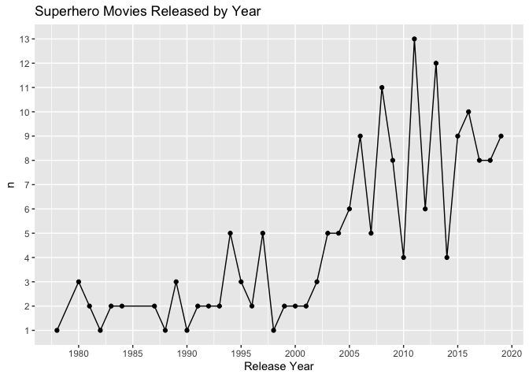

Superhero EDA - In Progress
================

  - [Introduction](#introduction)
  - [TMDb API](#tmdb-api)
  - [Packages](#packages)
  - [The Queries Pt 1](#the-queries-pt-1)
      - [Searching for Keywords](#searching-for-keywords)
      - [Superhero Movie Ids](#superhero-movie-ids)
      - [Movie Details](#movie-details)
  - [Super Analysis](#super-analysis)
  - [The Queries Pt 2](#the-queries-pt-2)
  - [The Finale](#the-finale)

## Introduction

It feels as though superhero movies have taken over the box office. It’s
hard to name a popular actor who hasn’t appeared in at least one film
where people can fly or move things with their minds. The goal of this
project is to dig deeper into the growth of superhero movies and
ultimately determine what percentage of popular actors have been in such
films. This analysis is extremely subjective, but it does give me a
great opportunity to utilize the `purrr` package to automate API calls.

All of the code used to conduct this analysis will be available in this
repository. More in-depth explanations of the code used will be
available in various posts on my
website.<https://mhdemoblog.netlify.app/>

## TMDb API

All of the data used in this analysis, will be queried from The Movie
Database. This site offers an API that is free to access with no rate
limiting. More information on the TMDb API can be found on their fact
page.

[TBDb API Documentation](https://www.themoviedb.org/documentation/api)

## Packages

``` r
library(tidyverse)
library(glue)
library(jsonlite)
library(janitor)
library(lubridate)
library(scales)
library(patchwork)
library(ggfittext)
library(xfun)
```

## The Queries Pt 1

Before I can conduct my analysis I will need to query the data using the
API. So what’s the best way to start?

### Searching for Keywords

First I need to find all of the keywords that contain the word
“superhero” and save the IDS for those keywords.

``` r
keyword_search <- "superhero"

fromJSON(glue("https://api.themoviedb.org/3/search/keyword?\\
                api_key={Sys.getenv('THE_MOVIE_DB_KEY')}\\
                &query={keyword_search}")) %>%
  pluck(2) %>% 
  head()
```

    ##                 name     id
    ## 1          superhero   9715
    ## 2       superheroine  10843
    ## 3     superhero team 155030
    ## 4    superhero spoof 157677
    ## 5 death of superhero 174016
    ## 6   masked superhero 180734

``` r
super_hero_key_ids <- fromJSON(glue("https://api.themoviedb.org/3/search/keyword?\\
                api_key={Sys.getenv('THE_MOVIE_DB_KEY')}\\
                &query={keyword_search}")) %>%
  pluck(2) %>% 
  pull(2)
```

### Superhero Movie Ids

Using the keyword IDS I can search for any movies that contain those
keywords. I just need to determine how many pages of results there are,
create a function that queries the individual pages, and use the `map`
function to iterate over those pages.

``` r
# without_genres=16 - removes movies classified as animation
# with_release_type=3 - filters for theatrical releases
(page_count <- fromJSON(glue("https://api.themoviedb.org/3/discover/movie?\\
                       api_key={Sys.getenv('THE_MOVIE_DB_KEY')}\\
                       &certification_country=US&language=en-US&\\
                       without_genres=16&\\
                       with_release_type=3\\
                       &region=US\\
                       &with_keywords=\\
                       {glue_collapse(super_hero_key_ids, sep = '|')}\\
                       &primary_release_date.gte=1970-01-01")) %>%
  pluck(3))
```

    ## [1] 10

``` r
super_discover_query <- function(page_num) {
  fromJSON(glue("https://api.themoviedb.org/3/discover/movie?\\
                       api_key={Sys.getenv('THE_MOVIE_DB_KEY')}\\
                       &certification_country=US&language=en-US&\\
                       without_genres=16&\\
                       with_release_type=3\\
                       &region=US\\
                       &with_keywords=\\
                       {glue_collapse(super_hero_key_ids, sep = '|')}\\
                       &primary_release_date.gte=1970-01-01&page={page_num}")) %>%
    pluck(4)
}

super_discover_query(1) %>%
  glimpse()
```

    ## Rows: 20
    ## Columns: 14
    ## $ popularity        <dbl> 289.008, 269.791, 227.186, 222.109, 209.604, 171.81…
    ## $ vote_count        <int> 3080, 135, 19557, 15870, 14867, 8243, 10008, 5601, …
    ## $ video             <lgl> FALSE, FALSE, FALSE, FALSE, FALSE, FALSE, FALSE, FA…
    ## $ poster_path       <chr> "/8WUVHemHFH2ZIP6NWkwlHWsyrEL.jpg", "/45FNxAIooJFqj…
    ## $ id                <int> 338762, 340102, 299536, 284054, 299534, 429617, 299…
    ## $ adult             <lgl> FALSE, FALSE, FALSE, FALSE, FALSE, FALSE, FALSE, FA…
    ## $ backdrop_path     <chr> "/lP5eKh8WOcPysfELrUpGhHJGZEH.jpg", "/eCIvqa3QVCx6H…
    ## $ original_language <chr> "en", "en", "en", "en", "en", "en", "en", "en", "en…
    ## $ original_title    <chr> "Bloodshot", "The New Mutants", "Avengers: Infinity…
    ## $ genre_ids         <list> [<28, 878>, <28, 12, 27, 878>, <28, 12, 878>, <28,…
    ## $ title             <chr> "Bloodshot", "The New Mutants", "Avengers: Infinity…
    ## $ vote_average      <dbl> 7.0, 6.0, 8.3, 7.4, 8.3, 7.5, 7.0, 7.1, 7.0, 6.7, 6…
    ## $ overview          <chr> "After he and his wife are murdered, marine Ray Gar…
    ## $ release_date      <chr> "2020-03-13", "2020-08-28", "2018-04-27", "2018-02-…

The function appears to work as the first two movies visible from the
`title` column are <i>Bloodshot</i> and <i>The New Mutants</i>. Next up
is the iteration.

``` r
hero_movie_id <- map_df(1:page_count,
                        ~super_discover_query(.x)) %>%
  pull(id)

hero_movie_id %>% 
  glimpse()
```

    ##  int [1:197] 338762 340102 299536 284054 299534 429617 299537 399579 287947 335983 ...

The results from the pages were combined into a single data frame. I
then used the `pull` function again to extract a vector containing the
movie ids. It looks as though there have been 197 movies released in
American theaters since Jan 1, 1970 that have been classified as
superhero films.

### Movie Details

I could use the rest of the data found in the discover API call, but I
want to know more. Have the budgets for superhero movies changed since
1970? Have they become more profitable? Additional information on these
movies’ cost and performance can be found using a slightly different API
call. Querying the data requires a similar process as collecting all of
the movie IDS.

``` r
super_detail_query <-  function(movie_id) {

  fromJSON(glue("https://api.themoviedb.org/3/movie/{movie_id}?\\
                api_key={Sys.getenv('THE_MOVIE_DB_KEY')}&language=en-US"))
}

super_detail_query(hero_movie_id[1]) %>%
  glimpse()
```

    ## List of 25
    ##  $ adult                : logi FALSE
    ##  $ backdrop_path        : chr "/lP5eKh8WOcPysfELrUpGhHJGZEH.jpg"
    ##  $ belongs_to_collection: NULL
    ##  $ budget               : int 42000000
    ##  $ genres               :'data.frame':   2 obs. of  2 variables:
    ##   ..$ id  : int [1:2] 28 878
    ##   ..$ name: chr [1:2] "Action" "Science Fiction"
    ##  $ homepage             : chr "https://www.bloodshot.movie/"
    ##  $ id                   : int 338762
    ##  $ imdb_id              : chr "tt1634106"
    ##  $ original_language    : chr "en"
    ##  $ original_title       : chr "Bloodshot"
    ##  $ overview             : chr "After he and his wife are murdered, marine Ray Garrison is resurrected by a team of scientists. Enhanced with n"| __truncated__
    ##  $ popularity           : num 289
    ##  $ poster_path          : chr "/8WUVHemHFH2ZIP6NWkwlHWsyrEL.jpg"
    ##  $ production_companies :'data.frame':   9 obs. of  4 variables:
    ##   ..$ id            : int [1:9] 34 10246 6573 333 103673 124335 5 1225 30148
    ##   ..$ logo_path     : chr [1:9] "/GagSvqWlyPdkFHMfQ3pNq6ix9P.png" "/rREvQNWAxkDfY9CDn2c5YxEMPdP.png" NA "/5xUJfzPZ8jWJUDzYtIeuPO4qPIa.png" ...
    ##   ..$ name          : chr [1:9] "Sony Pictures" "Cross Creek Pictures" "Mimran Schur Pictures" "Original Film" ...
    ##   ..$ origin_country: chr [1:9] "US" "US" "US" "US" ...
    ##  $ production_countries :'data.frame':   2 obs. of  2 variables:
    ##   ..$ iso_3166_1: chr [1:2] "CN" "US"
    ##   ..$ name      : chr [1:2] "China" "United States of America"
    ##  $ release_date         : chr "2020-03-05"
    ##  $ revenue              : int 30234182
    ##  $ runtime              : int 110
    ##  $ spoken_languages     :'data.frame':   1 obs. of  2 variables:
    ##   ..$ iso_639_1: chr "en"
    ##   ..$ name     : chr "English"
    ##  $ status               : chr "Released"
    ##  $ tagline              : chr "Being a superhero is in his blood"
    ##  $ title                : chr "Bloodshot"
    ##  $ video                : logi FALSE
    ##  $ vote_average         : num 6.9
    ##  $ vote_count           : int 3083

Wow\! This list contains a combination of lists and data frames. I can
see some fields that I’m interested in, such as `budget` and
`vote_average`. I just need to map over the movie IDS and transform
these list elements into a single data frame.

``` r
super_movies <- xfun::cache_rds({
  map(hero_movie_id,
       ~super_detail_query(.x)) %>%
    map_df(~as_tibble(t(.x))) %>%
    select(budget, imdb_id, original_title, title,
           release_date, revenue, runtime, status, vote_average,
           vote_count, id) %>%
    unnest(cols = everything()) %>%
    rename(movie_id = id) %>% 
    mutate(release_date = date(release_date))
})
```

``` r
super_movies %>%
  glimpse()
```

    ## Rows: 197
    ## Columns: 11
    ## $ budget         <int> 42000000, 67000000, 300000000, 200000000, 356000000, 1…
    ## $ imdb_id        <chr> "tt1634106", "tt4682266", "tt4154756", "tt1825683", "t…
    ## $ original_title <chr> "Bloodshot", "The New Mutants", "Avengers: Infinity Wa…
    ## $ title          <chr> "Bloodshot", "The New Mutants", "Avengers: Infinity Wa…
    ## $ release_date   <date> 2020-03-05, 2020-08-26, 2018-04-25, 2018-02-13, 2019-…
    ## $ revenue        <dbl> 30234182, 3100000, 2046239637, 1346739107, 2797800564,…
    ## $ runtime        <int> 110, 94, 149, 134, 181, 129, 124, 122, 132, 112, 114, …
    ## $ status         <chr> "Released", "Released", "Released", "Released", "Relea…
    ## $ vote_average   <dbl> 6.9, 6.0, 8.3, 7.4, 8.3, 7.5, 7.0, 7.1, 7.0, 6.7, 6.1,…
    ## $ vote_count     <int> 3083, 143, 19563, 15875, 14877, 8250, 10011, 5607, 549…
    ## $ movie_id       <int> 338762, 340102, 299536, 284054, 299534, 429617, 299537…

This looks much easier to interpret. All of the information that I want
is in a nice data frame and ready for some exploratory data analysis.

## Super Analysis

How many superhero movies have been released per year since 1970? Have
these movies become more profitable over time? I’ll attempt to answer
these questions with some simple plots. I’ve also chosen to adjust the
financial figures for inflation.

``` r
super_movies %>%
  mutate(release_year = year(release_date)) %>%
  filter(release_year < year(Sys.Date())) %>%
  count(release_year) %>%
  ggplot(aes(release_year, n)) +
  geom_line() + geom_point() +
  scale_y_continuous(breaks = breaks_width(1)) +
  scale_x_continuous(breaks = breaks_width(5)) +
  theme(panel.grid.minor.y = element_blank()) +
  labs(x = "Release Year", title = "Superhero Movies Released by Year")
```

<!-- -->

There has definitely been an upward trend in the number of superhero
movies released per year. More of these types of films start to pop up
around the mid 2000s. But were these newer superhero films more
successful than their older counterparts?

``` r
cpi_data <- read_csv("Data/cpi_data.csv")
curr_cpi <- cpi_data %>% 
  tail(1) %>% 
  pull(avg_cpi)
cpi_data <- cpi_data %>% 
  mutate(inf_rate = curr_cpi / avg_cpi) %>% 
  select(-avg_cpi)

super_movies_adj <- super_movies %>% 
  mutate(release_year = year(release_date)) %>%
  left_join(cpi_data, by = c("release_year" = "year")) %>% 
  mutate(across(.cols = c(budget, revenue),
                .fns = ~ inf_rate * .x,
                .names = "{col}_inf_adj"),
         profit = revenue_inf_adj - budget_inf_adj,
         roi = profit / budget_inf_adj)

super_summ <- super_movies_adj %>%
  filter(release_date < Sys.Date(), budget_inf_adj > 100000) %>%
  mutate(profit = revenue_inf_adj - budget_inf_adj,
         roi = profit / budget_inf_adj) %>%
  group_by(release_year) %>%
  summarize(across(.cols = c(budget_inf_adj, revenue_inf_adj, profit, roi),
                   .fns = median,
                   .names = "med_{col}"),
            .groups = "drop") %>%
  pivot_longer(cols = contains("med"), names_to = "metric")

super_summ %>%
  filter(metric != "med_roi", release_year < year(Sys.Date())) %>%
  ggplot(aes(release_year, value, col = metric)) +
  geom_line() + geom_point() +
  scale_y_continuous(labels = dollar, breaks = breaks_width(250000000)) +
  scale_x_continuous(breaks = breaks_width(5)) +
  geom_hline(yintercept = 0, linetype = "dashed") +
  labs(x = "Release Year", col = "Metric", title = "Median Performance by Year")
```

<!-- -->

``` r
super_summ %>%
  filter(metric == "med_roi", release_year < year(Sys.Date())) %>%
  ggplot(aes(release_year, value)) +
  geom_line() + geom_point() +
  scale_x_continuous(breaks = breaks_width(5)) +
  scale_y_continuous(labels = percent) +
  labs(x = "Release Year", y = "ROI", title = "Median ROI by Year")
```

<!-- --> There appear
to be some early superhero films that performed great at the box office
and offered investors some amazing returns. However, the highest returns
seem to be held by movies released after 2012. There also appear to be
less occurrences of annual losses for this genre after 2012. This could
be a product of studios’ improved understanding of how to produce and
market these types of movies.

Before I move on to collecting the cast information, I’d like to know
what the top performing movie of each decade was.

``` r
super_movies_adj %>% 
  filter(budget > 100000, release_date < Sys.Date()) %>% 
  mutate(decade = glue("{release_year - (release_year %% 10)}'s")) %>% 
  group_by(decade) %>% 
  slice_max(order_by = profit,
            n = 1) %>% 
  ggplot(aes(decade, profit, label = glue("{title}\n{percent(roi)} ROI"))) + geom_col() +
  geom_bar_text(reflow = TRUE) +
  scale_y_continuous(labels = dollar) +
  labs(x = "Decade", y = "Profit")
```

<!-- -->

This plot is pretty interesting. <i>Avengers: Endgame</i> is by far the
greatest superhero success at the box office, but 1989’s <i>Batman</i>
offered investors a higher rate of return at a whopping 1,075 % ROI. The
2020s have only shown negative returns for superhero films at the time
of this analysis.

## The Queries Pt 2

The movie data that I’ve collected so far is great, but it lacks any
information on the cast for each film. I’ll have to use a slightly
different set of API calls to collect all of the cast listing for the
movies I’ve identified.

``` r
cast_query <- function(movie_id) {
  fromJSON(glue("https://api.themoviedb.org/3/movie/{movie_id}\\
                /credits?api_key={Sys.getenv('THE_MOVIE_DB_KEY')}"))
}

super_cc <- xfun::cache_rds({
  map(hero_movie_id, ~cast_query(.x))
})

super_cast <- super_cc %>% 
  map_df(~as_tibble(t(.x))) %>% 
  select(-crew) %>% 
  unnest(c(id, cast), names_repair = "unique") %>% 
  rename(movie_id = 1, actor_id = 6, actor = 7) %>% 
  select(movie_id:order)
```

    ## New names:
    ## * id -> id...1
    ## * id -> id...6

Now that I have the cast data I can join it together with the rest of
the movie data.

``` r
super_data <- super_cast %>% 
  left_join(super_movies_adj,
            by = "movie_id") %>% 
  relocate(movie_id, title, budget_inf_adj, revenue_inf_adj, profit, character)
```

Before I move on to the last step, I’d like to answer a couple more
questions. First up, what actor has been in the most superhero movies?
This question should be pretty easy to answer for any MCU fan.

``` r
super_data %>% 
  count(actor) %>% 
  arrange(desc(n)) %>% 
  head()
```

    ## # A tibble: 6 x 2
    ##   actor                  n
    ##   <chr>              <int>
    ## 1 Stan Lee              43
    ## 2 Chris Evans           13
    ## 3 Samuel L. Jackson     13
    ## 4 Jimmy Star            12
    ## 5 Robert Downey Jr.     11
    ## 6 Scarlett Johansson    10

``` r
super_data %>% 
  filter(actor == "Stan Lee") %>% 
  slice_max(order_by = release_date, n = 1) %>% 
  select(title, release_date, actor, character)
```

    ## # A tibble: 1 x 4
    ##   title             release_date actor    character
    ##   <chr>             <date>       <chr>    <chr>    
    ## 1 Avengers: Endgame 2019-04-24   Stan Lee Driver

Stan Lee has made a cameo in nearly every Marvel film with his last
being <i>Avengers: Endgame</i>. His cameos were always a great touch in
the films. The other actors below Mr. Lee in appearances makes sense
except for one. Who is this Jimmy Star guy? If I dig a little deeper I
might be able to find out.

``` r
jimmy_credits <- pluck(fromJSON(glue("https://api.themoviedb.org/3\\
                               /person/1781358/movie_credits?\\
                               api_key={Sys.getenv('THE_MOVIE_DB_KEY')}&\\
                               language=en-US")), 1)

nrow(jimmy_credits)
```

    ## [1] 86

``` r
jimmy_credits %>% 
  arrange(desc(vote_average)) %>% 
  select(title, release_date, character, vote_average) %>% 
  head()
```

    ##                     title release_date                      character
    ## 1            Pulp Fiction   1994-09-10 Restaurant Patron (uncredited)
    ## 2                Scarface   1983-12-08       Boy at Pool (uncredited)
    ## 3                    Heat   1995-12-15 Restaurant Patron (uncredited)
    ## 4 Guardians of the Galaxy   2014-07-30          Prisoner (uncredited)
    ## 5     Catch Me If You Can   2002-12-25 Airline Passenger (uncredited)
    ## 6  Straight Outta Compton   2015-08-13      Record Mogul (uncredited)
    ##   vote_average
    ## 1          8.5
    ## 2          8.1
    ## 3          7.9
    ## 4          7.9
    ## 5          7.9
    ## 6          7.8

Mr. Star appears to be a very active extra. He’s had 12 appearances to
date in superhero films and 86 across all genres\! Above are the top
five movies that he’s appeared in by vote average.

## The Finale

The last thing that I need is collect a list of popular people as
defined by TMDb.

``` r
pop_pages <- fromJSON(glue("https://api.themoviedb.org/3/person/popular\\
              ?api_key={Sys.getenv('THE_MOVIE_DB_KEY')}&language=en-US")) %>% 
  pluck(3)

# Function to query the data from the popular search
pop_query <- function(page_num) {

fromJSON(glue("https://api.themoviedb.org/3/person/popular\\
              ?api_key={Sys.getenv('THE_MOVIE_DB_KEY')}&language=en-US&page={page_num}")) %>% 
    pluck(4)
}

# Maps pop_query functions over the total number of a pages
pop_actors <- xfun::cache_rds({
  map_df(.x = c(1:pop_pages),
         ~pop_query(.x))
})

pop_actors %>% 
  select(popularity:name) %>% 
  slice_sample(n = 10)
```

    ##    popularity known_for_department             name
    ## 1       2.696               Acting    Ramon Novarro
    ## 2       3.495               Acting   Aleksey Chadov
    ## 3       2.256               Acting   Charles Cioffi
    ## 4       3.632               Acting     Bella Ramsey
    ## 5       2.100               Acting      Brion James
    ## 6       3.936               Acting  Cybill Shepherd
    ## 7       4.865               Acting Leon Allen White
    ## 8       2.656               Acting      Jacque Gray
    ## 9       2.303               Acting         Sam Page
    ## 10      3.152               Acting    Jeanne Moreau

This list is great but it contains some popular people that I don’t
want. I only want to focus current, popular, movie actors. I decided to
filter for actors who have been in a American movie since 2005 and who
are in the 75th percentile based upon the popularity metric.

``` r
top_pop_perf <- pop_actors %>%
  # Unnest the known_for data frames for each actor
  unnest(known_for, names_repair = "unique") %>% 
  rename(actor = 3, actor_id = 4,
         movie_id = 11) %>% 
  # Removes missing release date rows
  filter(release_date > 0) %>%  
  mutate(release_date = date(release_date)) %>% 
  group_by(actor) %>% 
  # Filters for the oldest known_for item for each actor
  slice_min(order_by = release_date, n = 1) %>% 
  ungroup() %>%
  filter(release_date > "2005-01-01", media_type == "movie", 
         known_for_department == "Acting", 
         original_language == "en") %>%
  # Creates a quantile value for each actor based upon their popularity
  mutate(q_rank = ntile(popularity, 4)) %>% 
  filter(q_rank == 4) %>% 
  select(actor, actor_id)

top_pop_perf %>% 
  nrow()
```

    ## [1] 734

``` r
top_pop_perf %>% 
  slice_sample(n = 10)
```

    ## # A tibble: 10 x 2
    ##    actor               actor_id
    ##    <chr>                  <int>
    ##  1 Michael B. Jordan     135651
    ##  2 Jodie Whittaker        66431
    ##  3 Matthew McConaughey    10297
    ##  4 David Warshofsky       37204
    ##  5 Katherine Heigl        25541
    ##  6 Nick Robinson        1108907
    ##  7 Britt Robertson        52018
    ##  8 Meredith Salenger      18706
    ##  9 Rose McIver            53485
    ## 10 Kevin Costner           1269

After filtering I’ve narrowed the pool down to the top 734 actors. A
sample of this pool should show more recognizable names.

I can use the setdiff function to identify the popular actors who have
never been in a superhero film.

``` r
non_supers <- top_pop_perf %>% 
  dplyr::setdiff(super_data %>% 
                   distinct(actor, actor_id))

(super_perc <- percent(1 - nrow(non_supers) / nrow(top_pop_perf)))
```

    ## [1] "31%"

``` r
non_supers %>% 
  slice_sample(n = 15)
```

    ## # A tibble: 15 x 2
    ##    actor                  actor_id
    ##    <chr>                     <int>
    ##  1 Josh Duhamel              19536
    ##  2 Christina Hendricks      110014
    ##  3 Lisa Kudrow               14406
    ##  4 Paul Anderson            220448
    ##  5 Ashlynn Yennie           121575
    ##  6 Benjamin Hollingsworth    77865
    ##  7 Richard Harmon           144852
    ##  8 D.B. Woodside             21356
    ##  9 Jessica Hecht             14984
    ## 10 Alexis Hollins          1316197
    ## 11 Gillian Anderson          12214
    ## 12 Kaya Scodelario          115150
    ## 13 Dallas Roberts              424
    ## 14 Eddie Redmayne            37632
    ## 15 Cody Christian           219664

``` r
top_pop_perf %>% 
  slice_sample(n = 3)
```

    ## # A tibble: 3 x 2
    ##   actor             actor_id
    ##   <chr>                <int>
    ## 1 Keri Russell         41292
    ## 2 Danielle Campbell   114372
    ## 3 William Shatner       1748

After a little work I have my very rough estimate of how many popular
actors have been in a superhero film, 31%. So roughly 1 out of every 3
popular actors is a pretty big proportion. Throughout this process I
noticed some exceptions that seemed to crop up. Eva Mendes is
categorized as a non-super but she starred in 2007’s <i>Ghost Rider</i>,
which isn’t designated as a superhero film. Subjective factors like this
have influenced every facet of this analysis.
