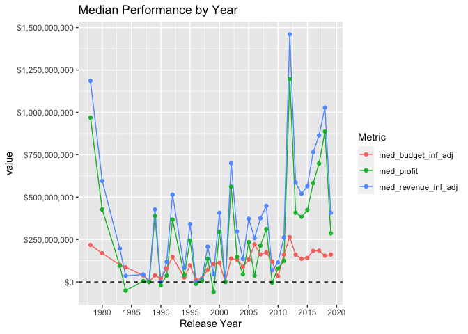

Superhero EDA - In Progress
================

  - [Introduction](#introduction)
  - [TMDb API](#tmdb-api)
  - [Packages](#packages)
  - [The Queries Pt.1](#the-queries-pt.1)
      - [Searching for Keywords](#searching-for-keywords)
      - [Superhero Movie Ids](#superhero-movie-ids)
      - [Movie Details](#movie-details)
  - [Super Analysis](#super-analysis)

## Introduction

It feels as though superhero movies have taken over the box office. It’s
almost hard to name a popular performer who hasn’t had an appearance in
at least one film where people can fly or move things with their minds.
The goals of this project is dig deeper into the growth of superhero
movies and ultimately determine what percentage of popular performers
have been in such films. This analysis is extremely subjective, but it
does give me a great opportunity to utilize the `purrr` package to
automate API calls.

All of the code used to conduct this analysis will be available in this
repository. More in-depth explanations of the code used will be
available in various posts on my
website.<https://mhdemoblog.netlify.app/>

## TMDb API

All of the data used in this analysis will be queried from The Movie
Database. This site offers an API that is free to access with no rate
limiting. More information on the TMDb API can be found on their fact
page.

[TBDb API Documentation](https://www.themoviedb.org/documentation/api)

## Packages

``` r
library(tidyverse)
library(glue)
library(jsonlite)
library(janitor)
library(lubridate)
library(scales)
library(patchwork)
```

## The Queries Pt.1

Before I can conduct my analysis I will need to query the data using the
API. So what’s the best way to start?

### Searching for Keywords

First I need to find all fo the keywords that contain the word
“superhero” and save the ids for those keywords.

``` r
keyword_search <- "superhero"

fromJSON(glue("https://api.themoviedb.org/3/search/keyword?\\
                api_key={Sys.getenv('THE_MOVIE_DB_KEY')}\\
                &query={keyword_search}")) %>%
  pluck(2) %>% 
  head()
```

    ##                 name     id
    ## 1          superhero   9715
    ## 2       superheroine  10843
    ## 3     superhero team 155030
    ## 4    superhero spoof 157677
    ## 5 death of superhero 174016
    ## 6   masked superhero 180734

``` r
super_hero_key_ids <- fromJSON(glue("https://api.themoviedb.org/3/search/keyword?\\
                api_key={Sys.getenv('THE_MOVIE_DB_KEY')}\\
                &query={keyword_search}")) %>%
  pluck(2) %>% 
  pull(2)
```

### Superhero Movie Ids

Using the keyword ids I can search for any movies that contain those
keywords. I just need to determine how many pages of results there are,
create a function that queries the individual pages, and use the `map`
function to iterate over those pages.

``` r
# without_genres=16 - removes movies classified as animation
# with_release_type=3 - filters for theatrical releases
(page_count <- fromJSON(glue("https://api.themoviedb.org/3/discover/movie?\\
                       api_key={Sys.getenv('THE_MOVIE_DB_KEY')}\\
                       &certification_country=US&language=en-US&\\
                       without_genres=16&\\
                       with_release_type=3\\
                       &region=US\\
                       &with_keywords=\\
                       {glue_collapse(super_hero_key_ids, sep = '|')}\\
                       &primary_release_date.gte=1970-01-01")) %>%
  pluck(3))
```

    ## [1] 10

``` r
super_discover_query <- function(page_num) {
  fromJSON(glue("https://api.themoviedb.org/3/discover/movie?\\
                       api_key={Sys.getenv('THE_MOVIE_DB_KEY')}\\
                       &certification_country=US&language=en-US&\\
                       without_genres=16&\\
                       with_release_type=3\\
                       &region=US\\
                       &with_keywords=\\
                       {glue_collapse(super_hero_key_ids, sep = '|')}\\
                       &primary_release_date.gte=1970-01-01&page={page_num}")) %>%
    pluck(4)
}

super_discover_query(1) %>%
  glimpse()
```

    ## Rows: 20
    ## Columns: 14
    ## $ popularity        <dbl> 205.191, 156.450, 175.703, 127.327, 131.416, 107.03…
    ## $ vote_count        <int> 19486, 62, 3052, 8200, 14790, 9958, 9542, 15765, 14…
    ## $ video             <lgl> FALSE, FALSE, FALSE, FALSE, FALSE, FALSE, FALSE, FA…
    ## $ poster_path       <chr> "/7WsyChQLEftFiDOVTGkv3hFpyyt.jpg", "/xZNw9xxtwbEf2…
    ## $ id                <int> 299536, 340102, 338762, 429617, 299534, 299537, 141…
    ## $ adult             <lgl> FALSE, FALSE, FALSE, FALSE, FALSE, FALSE, FALSE, FA…
    ## $ backdrop_path     <chr> "/bOGkgRGdhrBYJSLpXaxhXVstddV.jpg", "/2AFZyra0Ddwl2…
    ## $ original_language <chr> "en", "en", "en", "en", "en", "en", "en", "en", "en…
    ## $ original_title    <chr> "Avengers: Infinity War", "The New Mutants", "Blood…
    ## $ genre_ids         <list> [<28, 12, 878>, <28, 12, 27, 878>, <28, 878>, <28,…
    ## $ title             <chr> "Avengers: Infinity War", "The New Mutants", "Blood…
    ## $ vote_average      <dbl> 8.3, 5.8, 7.0, 7.5, 8.3, 7.0, 6.2, 7.4, 7.4, 7.6, 7…
    ## $ overview          <chr> "As the Avengers and their allies have continued to…
    ## $ release_date      <chr> "2018-04-27", "2020-08-28", "2020-03-13", "2019-07-…

The function appears to work as the first two movies visible from the
`title` column are “Avengers: Infinity War” and “The New Mutants”. Next
up is the iteration.

``` r
hero_movie_id <- map_df(1:page_count,
                        ~super_discover_query(.x)) %>%
  pull(id)

hero_movie_id %>% 
  glimpse()
```

    ##  int [1:197] 299536 340102 338762 429617 299534 299537 141052 284054 315635 284053 ...

The results from the pages were combined into a single data frame. I
then used the `pull` function again to extract a vector containing the
movie ids. It looks as though there have been 197 movies released in
American theaters since Jan 1, 1970 that have been classified as being a
superhero film.

### Movie Details

I could use the rest of the data found in the discover API call, but I
want to know more. Have the budgets for superhero movies changed since
1970? Have they become more profitable? Additional information on how
these movies performed can be found using a slightly different API call.
Querying the data requires a similar process as collecting all of the
movie ids.

``` r
super_detail_query <-  function(movie_id) {

  fromJSON(glue("https://api.themoviedb.org/3/movie/{movie_id}?\\
                api_key={Sys.getenv('THE_MOVIE_DB_KEY')}&language=en-US"))
}

super_detail_query(hero_movie_id[1]) %>%
  glimpse()
```

    ## List of 25
    ##  $ adult                : logi FALSE
    ##  $ backdrop_path        : chr "/bOGkgRGdhrBYJSLpXaxhXVstddV.jpg"
    ##  $ belongs_to_collection:List of 4
    ##   ..$ id           : int 86311
    ##   ..$ name         : chr "The Avengers Collection"
    ##   ..$ poster_path  : chr "/tqXiOD5rTyHgabO73Tpw9JDbd88.jpg"
    ##   ..$ backdrop_path: chr "/zuW6fOiusv4X9nnW3paHGfXcSll.jpg"
    ##  $ budget               : int 300000000
    ##  $ genres               :'data.frame':   3 obs. of  2 variables:
    ##   ..$ id  : int [1:3] 12 28 878
    ##   ..$ name: chr [1:3] "Adventure" "Action" "Science Fiction"
    ##  $ homepage             : chr "https://www.marvel.com/movies/avengers-infinity-war"
    ##  $ id                   : int 299536
    ##  $ imdb_id              : chr "tt4154756"
    ##  $ original_language    : chr "en"
    ##  $ original_title       : chr "Avengers: Infinity War"
    ##  $ overview             : chr "As the Avengers and their allies have continued to protect the world from threats too large for any one hero to"| __truncated__
    ##  $ popularity           : num 168
    ##  $ poster_path          : chr "/7WsyChQLEftFiDOVTGkv3hFpyyt.jpg"
    ##  $ production_companies :'data.frame':   1 obs. of  4 variables:
    ##   ..$ id            : int 420
    ##   ..$ logo_path     : chr "/hUzeosd33nzE5MCNsZxCGEKTXaQ.png"
    ##   ..$ name          : chr "Marvel Studios"
    ##   ..$ origin_country: chr "US"
    ##  $ production_countries :'data.frame':   1 obs. of  2 variables:
    ##   ..$ iso_3166_1: chr "US"
    ##   ..$ name      : chr "United States of America"
    ##  $ release_date         : chr "2018-04-25"
    ##  $ revenue              : int 2046239637
    ##  $ runtime              : int 149
    ##  $ spoken_languages     :'data.frame':   2 obs. of  2 variables:
    ##   ..$ iso_639_1: chr [1:2] "en" "xh"
    ##   ..$ name     : chr [1:2] "English" ""
    ##  $ status               : chr "Released"
    ##  $ tagline              : chr "An entire universe. Once and for all."
    ##  $ title                : chr "Avengers: Infinity War"
    ##  $ video                : logi FALSE
    ##  $ vote_average         : num 8.3
    ##  $ vote_count           : int 19485

Wow\! This list contains a combination of lists and data frames. I can
see some fields that I’m interested in such as `budget` and
`vote_average`. I just need to map over the movie ids and transform
these list elements into a single data frame.

``` r
super_movies <- map(hero_movie_id,
                        ~super_detail_query(.x)) %>%
  map_df(~as_tibble(t(.x))) %>%
  select(budget, imdb_id, original_title, title,
         release_date, revenue, runtime, status, vote_average,
         vote_count, id) %>%
  unnest(cols = everything()) %>%
  rename(movie_id = id)
```

``` r
super_movies %>%
  glimpse()
```

    ## Rows: 197
    ## Columns: 11
    ## $ budget         <int> 300000000, 67000000, 42000000, 160000000, 356000000, 1…
    ## $ imdb_id        <chr> "tt4154756", "tt4682266", "tt1634106", "tt6320628", "t…
    ## $ original_title <chr> "Avengers: Infinity War", "The New Mutants", "Bloodsho…
    ## $ title          <chr> "Avengers: Infinity War", "The New Mutants", "Bloodsho…
    ## $ release_date   <chr> "2018-04-25", "2020-08-26", "2020-03-05", "2019-06-28"…
    ## $ revenue        <dbl> 2046239637, 0, 30234182, 1131927996, 2797800564, 11282…
    ## $ runtime        <int> 149, 98, 110, 129, 181, 124, 120, 134, 133, 131, 122, …
    ## $ status         <chr> "Released", "Released", "Released", "Released", "Relea…
    ## $ vote_average   <dbl> 8.3, 5.9, 7.0, 7.5, 8.3, 7.0, 6.2, 7.4, 7.4, 7.6, 7.1,…
    ## $ vote_count     <int> 19485, 60, 3052, 8199, 14788, 9958, 9542, 15766, 14779…
    ## $ movie_id       <int> 299536, 340102, 338762, 429617, 299534, 299537, 141052…

This looks way easier to interpret. All of the information that I want
is in a nice data frame and ready for some exploratory data analysis.

## Super Analysis

How many superhero movies have been released per year since 1970? Have
these movies become more profitable over time. I’ll attempt to answer
these questions with some simple plots. I’ve also chosen to adjust the
financial figures for inflation.

``` r
super_movies %>%
  mutate(release_year = year(release_date)) %>%
  filter(release_year < year(Sys.Date())) %>%
  count(release_year) %>%
  ggplot(aes(release_year, n)) +
  geom_line() + geom_point() +
  scale_y_continuous(breaks = breaks_width(1)) +
  scale_x_continuous(breaks = breaks_width(5)) +
  theme(panel.grid.minor.y = element_blank()) +
  labs(x = "Release Year", title = "Superhero Movies Released by Year")
```

<!-- -->

There has definitely been an upward trend in superhero movie releases.
More of these types of films start to pop up around the mid 2000’s. But
were these newer superhero films more successful than their older
counterparts?

``` r
cpi_data <- read_csv("Data/cpi_data.csv")
curr_cpi <- cpi_data %>% 
  tail(1) %>% 
  pull(avg_cpi)
cpi_data <- cpi_data %>% 
  mutate(inf_rate = curr_cpi / avg_cpi) %>% 
  select(-avg_cpi)

super_movies_adj <- super_movies %>% 
  mutate(release_year = year(release_date)) %>%
  left_join(cpi_data, by = c("release_year" = "year")) %>% 
  mutate(across(.cols = c(budget, revenue),
                .fns = ~ inf_rate * .x,
                .names = "{col}_inf_adj"),
         profit = revenue_inf_adj - budget_inf_adj,
         roi = profit / budget_inf_adj)

super_summ <- super_movies_adj %>%
  filter(release_date < Sys.Date(), budget_inf_adj > 100000) %>%
  mutate(profit = revenue_inf_adj - budget_inf_adj,
         roi = profit / budget_inf_adj) %>%
  group_by(release_year) %>%
  summarize(across(.cols = c(budget_inf_adj, revenue_inf_adj, profit, roi),
                   .fns = median,
                   .names = "med_{col}"),
            .groups = "drop") %>%
  pivot_longer(cols = contains("med"), names_to = "metric")

super_summ %>%
  filter(metric != "med_roi", release_year < year(Sys.Date())) %>%
  ggplot(aes(release_year, value, col = metric)) +
  geom_line() + geom_point() +
  scale_y_continuous(labels = dollar, breaks = breaks_width(250000000)) +
  scale_x_continuous(breaks = breaks_width(5)) +
  geom_hline(yintercept = 0, linetype = "dashed") +
  labs(x = "Release Year", col = "Metric", title = "Median Performance by Year")
```

<!-- -->

``` r
super_summ %>%
  filter(metric == "med_roi", release_year < year(Sys.Date())) %>%
  ggplot(aes(release_year, value)) +
  geom_line() + geom_point() +
  scale_x_continuous(breaks = breaks_width(5)) +
  scale_y_continuous(labels = percent) +
  labs(x = "Release Year", y = "ROI", title = "Median ROI by Year")
```

<!-- --> There appear
to be some early superhero films perform great at the box office and
offered investors some amazing returns. The highest returns seem to be
held by movies released after 2012. There also appear to be less
occurrences of annual losses for this genre after 2012. This could be a
product of studios better understanding how to produce and market these
types of movies.

Before I move on to collecting the cast information I’d like to what top
performing movie of each year was.

``` r
super_movies_adj %>% 
  filter(budget > 100000) %>% 
  group_by(release_year) %>% 
  slice_max(order_by = roi,
            n = 1) %>% 
  select(title, budget_inf_adj, profit, roi, release_year) %>% 
  ggplot(aes(release_year, roi)) + geom_col() +
  coord_flip()
```

<!-- -->
