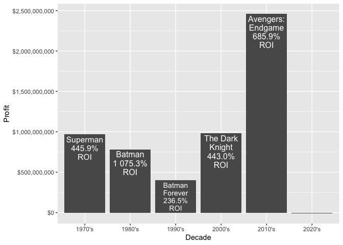

Superhero EDA - In Progress
================

  - [Introduction](#introduction)
  - [TMDb API](#tmdb-api)
  - [Packages](#packages)
  - [The Queries Pt.1](#the-queries-pt.1)
      - [Searching for Keywords](#searching-for-keywords)
      - [Superhero Movie Ids](#superhero-movie-ids)
      - [Movie Details](#movie-details)
  - [Super Analysis](#super-analysis)

## Introduction

It feels as though superhero movies have taken over the box office. It’s
hard to name a popular performer who hasn’t appeared in at least one
film where people can fly or move things with their minds. The goal of
this project is to dig deeper into the growth of superhero movies and
ultimately determine what percentage of popular performers have been in
such films. This analysis is extremely subjective, but it does give me a
great opportunity to utilize the `purrr` package to automate API calls.

All of the code used to conduct this analysis will be available in this
repository. More in-depth explanations of the code used will be
available in various posts on my
website.<https://mhdemoblog.netlify.app/>

## TMDb API

All of the data used in this analysis, will be queried from The Movie
Database. This site offers an API that is free to access with no rate
limiting. More information on the TMDb API can be found on their fact
page.

[TBDb API Documentation](https://www.themoviedb.org/documentation/api)

## Packages

``` r
library(tidyverse)
library(glue)
library(jsonlite)
library(janitor)
library(lubridate)
library(scales)
library(patchwork)
library(ggfittext)
```

## The Queries Pt.1

Before I can conduct my analysis I will need to query the data using the
API. So what’s the best way to start?

### Searching for Keywords

First I need to find all of the keywords that contain the word
“superhero” and save the IDS for those keywords.

``` r
keyword_search <- "superhero"

fromJSON(glue("https://api.themoviedb.org/3/search/keyword?\\
                api_key={Sys.getenv('THE_MOVIE_DB_KEY')}\\
                &query={keyword_search}")) %>%
  pluck(2) %>% 
  head()
```

    ##                 name     id
    ## 1          superhero   9715
    ## 2       superheroine  10843
    ## 3     superhero team 155030
    ## 4    superhero spoof 157677
    ## 5 death of superhero 174016
    ## 6   masked superhero 180734

``` r
super_hero_key_ids <- fromJSON(glue("https://api.themoviedb.org/3/search/keyword?\\
                api_key={Sys.getenv('THE_MOVIE_DB_KEY')}\\
                &query={keyword_search}")) %>%
  pluck(2) %>% 
  pull(2)
```

### Superhero Movie Ids

Using the keyword IDS I can search for any movies that contain those
keywords. I just need to determine how many pages of results there are,
create a function that queries the individual pages, and use the `map`
function to iterate over those pages.

``` r
# without_genres=16 - removes movies classified as animation
# with_release_type=3 - filters for theatrical releases
(page_count <- fromJSON(glue("https://api.themoviedb.org/3/discover/movie?\\
                       api_key={Sys.getenv('THE_MOVIE_DB_KEY')}\\
                       &certification_country=US&language=en-US&\\
                       without_genres=16&\\
                       with_release_type=3\\
                       &region=US\\
                       &with_keywords=\\
                       {glue_collapse(super_hero_key_ids, sep = '|')}\\
                       &primary_release_date.gte=1970-01-01")) %>%
  pluck(3))
```

    ## [1] 10

``` r
super_discover_query <- function(page_num) {
  fromJSON(glue("https://api.themoviedb.org/3/discover/movie?\\
                       api_key={Sys.getenv('THE_MOVIE_DB_KEY')}\\
                       &certification_country=US&language=en-US&\\
                       without_genres=16&\\
                       with_release_type=3\\
                       &region=US\\
                       &with_keywords=\\
                       {glue_collapse(super_hero_key_ids, sep = '|')}\\
                       &primary_release_date.gte=1970-01-01&page={page_num}")) %>%
    pluck(4)
}

super_discover_query(1) %>%
  glimpse()
```

    ## Rows: 20
    ## Columns: 14
    ## $ popularity        <dbl> 209.943, 206.434, 205.109, 174.033, 226.101, 140.46…
    ## $ vote_count        <int> 15854, 3072, 19551, 14852, 116, 8235, 10002, 5598, …
    ## $ video             <lgl> FALSE, FALSE, FALSE, FALSE, FALSE, FALSE, FALSE, FA…
    ## $ poster_path       <chr> "/uxzzxijgPIY7slzFvMotPv8wjKA.jpg", "/8WUVHemHFH2ZI…
    ## $ id                <int> 284054, 338762, 299536, 299534, 340102, 429617, 299…
    ## $ adult             <lgl> FALSE, FALSE, FALSE, FALSE, FALSE, FALSE, FALSE, FA…
    ## $ backdrop_path     <chr> "/6ELJEzQJ3Y45HczvreC3dg0GV5R.jpg", "/lP5eKh8WOcPys…
    ## $ original_language <chr> "en", "en", "en", "en", "en", "en", "en", "en", "en…
    ## $ original_title    <chr> "Black Panther", "Bloodshot", "Avengers: Infinity W…
    ## $ genre_ids         <list> [<28, 12, 14, 878>, <28, 878>, <28, 12, 878>, <28,…
    ## $ title             <chr> "Black Panther", "Bloodshot", "Avengers: Infinity W…
    ## $ vote_average      <dbl> 7.4, 7.0, 8.3, 8.3, 6.0, 7.5, 7.0, 7.1, 7.6, 6.1, 6…
    ## $ overview          <chr> "King T'Challa returns home from America to the rec…
    ## $ release_date      <chr> "2018-02-16", "2020-03-13", "2018-04-27", "2019-04-…

The function appears to work as the first two movies visible from the
`title` column are <i>Black Panther</i> and <i>Bloodshot</i>. Next up is
the iteration.

``` r
hero_movie_id <- map_df(1:page_count,
                        ~super_discover_query(.x)) %>%
  pull(id)

hero_movie_id %>% 
  glimpse()
```

    ##  int [1:197] 284054 338762 299536 299534 340102 429617 299537 399579 284053 320288 ...

The results from the pages were combined into a single data frame. I
then used the `pull` function again to extract a vector containing the
movie ids. It looks as though there have been 197 movies released in
American theaters since Jan 1, 1970 that have been classified as
superhero films.

### Movie Details

I could use the rest of the data found in the discover API call, but I
want to know more. Have the budgets for superhero movies changed since
1970? Have they become more profitable? Additional information on these
movies’ cost and performance can be found using a slightly different API
call. Querying the data requires a similar process as collecting all of
the movie IDS.

``` r
super_detail_query <-  function(movie_id) {

  fromJSON(glue("https://api.themoviedb.org/3/movie/{movie_id}?\\
                api_key={Sys.getenv('THE_MOVIE_DB_KEY')}&language=en-US"))
}

super_detail_query(hero_movie_id[1]) %>%
  glimpse()
```

    ## List of 25
    ##  $ adult                : logi FALSE
    ##  $ backdrop_path        : chr "/6ELJEzQJ3Y45HczvreC3dg0GV5R.jpg"
    ##  $ belongs_to_collection: NULL
    ##  $ budget               : int 200000000
    ##  $ genres               :'data.frame':   4 obs. of  2 variables:
    ##   ..$ id  : int [1:4] 28 12 14 878
    ##   ..$ name: chr [1:4] "Action" "Adventure" "Fantasy" "Science Fiction"
    ##  $ homepage             : chr "https://marvel.com/movies/movie/224/black_panther"
    ##  $ id                   : int 284054
    ##  $ imdb_id              : chr "tt1825683"
    ##  $ original_language    : chr "en"
    ##  $ original_title       : chr "Black Panther"
    ##  $ overview             : chr "King T'Challa returns home from America to the reclusive, technologically advanced African nation of Wakanda to"| __truncated__
    ##  $ popularity           : num 230
    ##  $ poster_path          : chr "/uxzzxijgPIY7slzFvMotPv8wjKA.jpg"
    ##  $ production_companies :'data.frame':   2 obs. of  4 variables:
    ##   ..$ id            : int [1:2] 420 2
    ##   ..$ logo_path     : chr [1:2] "/hUzeosd33nzE5MCNsZxCGEKTXaQ.png" "/wdrCwmRnLFJhEoH8GSfymY85KHT.png"
    ##   ..$ name          : chr [1:2] "Marvel Studios" "Walt Disney Pictures"
    ##   ..$ origin_country: chr [1:2] "US" "US"
    ##  $ production_countries :'data.frame':   1 obs. of  2 variables:
    ##   ..$ iso_3166_1: chr "US"
    ##   ..$ name      : chr "United States of America"
    ##  $ release_date         : chr "2018-02-13"
    ##  $ revenue              : int 1346739107
    ##  $ runtime              : int 134
    ##  $ spoken_languages     :'data.frame':   4 obs. of  2 variables:
    ##   ..$ iso_639_1: chr [1:4] "en" "ko" "sw" "xh"
    ##   ..$ name     : chr [1:4] "English" "한국어/조선말" "Kiswahili" ""
    ##  $ status               : chr "Released"
    ##  $ tagline              : chr "Long live the king."
    ##  $ title                : chr "Black Panther"
    ##  $ video                : logi FALSE
    ##  $ vote_average         : num 7.4
    ##  $ vote_count           : int 15849

Wow\! This list contains a combination of lists and data frames. I can
see some fields that I’m interested in, such as `budget` and
`vote_average`. I just need to map over the movie IDS and transform
these list elements into a single data frame.

``` r
super_movies <- map(hero_movie_id,
                        ~super_detail_query(.x)) %>%
  map_df(~as_tibble(t(.x))) %>%
  select(budget, imdb_id, original_title, title,
         release_date, revenue, runtime, status, vote_average,
         vote_count, id) %>%
  unnest(cols = everything()) %>%
  rename(movie_id = id)

# Used when working on the analysis to speed up the knit process
#saveRDS(super_movies, "Data/superMovies.RDS")
```

``` r
super_movies %>%
  glimpse()
```

    ## Rows: 197
    ## Columns: 11
    ## $ budget         <int> 200000000, 42000000, 300000000, 356000000, 67000000, 1…
    ## $ imdb_id        <chr> "tt1825683", "tt1634106", "tt4154756", "tt4154796", "t…
    ## $ original_title <chr> "Black Panther", "Bloodshot", "Avengers: Infinity War"…
    ## $ title          <chr> "Black Panther", "Bloodshot", "Avengers: Infinity War"…
    ## $ release_date   <chr> "2018-02-13", "2020-03-05", "2018-04-25", "2019-04-24"…
    ## $ revenue        <dbl> 1346739107, 30234182, 2046239637, 2797800564, 3100000,…
    ## $ runtime        <int> 134, 110, 149, 181, 94, 129, 124, 122, 131, 114, 120, …
    ## $ status         <chr> "Released", "Released", "Released", "Released", "Relea…
    ## $ vote_average   <dbl> 7.4, 7.0, 8.3, 8.3, 6.0, 7.5, 7.0, 7.1, 7.6, 6.1, 6.2,…
    ## $ vote_count     <int> 15849, 3072, 19549, 14851, 113, 8232, 10000, 5597, 145…
    ## $ movie_id       <int> 284054, 338762, 299536, 299534, 340102, 429617, 299537…

This looks much easier to interpret. All of the information that I want
is in a nice data frame and ready for some exploratory data analysis.

## Super Analysis

How many superhero movies have been released per year since 1970? Have
these movies become more profitable over time? I’ll attempt to answer
these questions with some simple plots. I’ve also chosen to adjust the
financial figures for inflation.

``` r
super_movies %>%
  mutate(release_year = year(release_date)) %>%
  filter(release_year < year(Sys.Date())) %>%
  count(release_year) %>%
  ggplot(aes(release_year, n)) +
  geom_line() + geom_point() +
  scale_y_continuous(breaks = breaks_width(1)) +
  scale_x_continuous(breaks = breaks_width(5)) +
  theme(panel.grid.minor.y = element_blank()) +
  labs(x = "Release Year", title = "Superhero Movies Released by Year")
```

<!-- -->

There has definitely been an upward trend in the number of superhero
movies released per year. More of these types of films start to pop up
around the mid 2000s. But were these newer superhero films more
successful than their older counterparts?

``` r
cpi_data <- read_csv("Data/cpi_data.csv")
curr_cpi <- cpi_data %>% 
  tail(1) %>% 
  pull(avg_cpi)
cpi_data <- cpi_data %>% 
  mutate(inf_rate = curr_cpi / avg_cpi) %>% 
  select(-avg_cpi)

super_movies_adj <- super_movies %>% 
  mutate(release_year = year(release_date)) %>%
  left_join(cpi_data, by = c("release_year" = "year")) %>% 
  mutate(across(.cols = c(budget, revenue),
                .fns = ~ inf_rate * .x,
                .names = "{col}_inf_adj"),
         profit = revenue_inf_adj - budget_inf_adj,
         roi = profit / budget_inf_adj)

super_summ <- super_movies_adj %>%
  filter(release_date < Sys.Date(), budget_inf_adj > 100000) %>%
  mutate(profit = revenue_inf_adj - budget_inf_adj,
         roi = profit / budget_inf_adj) %>%
  group_by(release_year) %>%
  summarize(across(.cols = c(budget_inf_adj, revenue_inf_adj, profit, roi),
                   .fns = median,
                   .names = "med_{col}"),
            .groups = "drop") %>%
  pivot_longer(cols = contains("med"), names_to = "metric")

super_summ %>%
  filter(metric != "med_roi", release_year < year(Sys.Date())) %>%
  ggplot(aes(release_year, value, col = metric)) +
  geom_line() + geom_point() +
  scale_y_continuous(labels = dollar, breaks = breaks_width(250000000)) +
  scale_x_continuous(breaks = breaks_width(5)) +
  geom_hline(yintercept = 0, linetype = "dashed") +
  labs(x = "Release Year", col = "Metric", title = "Median Performance by Year")
```

<!-- -->

``` r
super_summ %>%
  filter(metric == "med_roi", release_year < year(Sys.Date())) %>%
  ggplot(aes(release_year, value)) +
  geom_line() + geom_point() +
  scale_x_continuous(breaks = breaks_width(5)) +
  scale_y_continuous(labels = percent) +
  labs(x = "Release Year", y = "ROI", title = "Median ROI by Year")
```

<!-- --> There appear
to be some early superhero films that performed great at the box office
and offered investors some amazing returns. However, the highest returns
seem to be held by movies released after 2012. There also appear to be
less occurrences of annual losses for this genre after 2012. This could
be a product of studios’ improved understanding of how to produce and
market these types of movies.

Before I move on to collecting the cast information, I’d like to know
what the top performing movie of each decade was.

``` r
super_movies_adj %>% 
  filter(budget > 100000, release_date < Sys.Date()) %>% 
  mutate(decade = glue("{release_year - (release_year %% 10)}'s")) %>% 
  group_by(decade) %>% 
  slice_max(order_by = profit,
            n = 1) %>% 
  ggplot(aes(decade, profit, label = glue("{title}\n{percent(roi)} ROI"))) + geom_col() +
  geom_bar_text(reflow = TRUE) +
  scale_y_continuous(labels = dollar) +
  labs(x = "Decade", y = "Profit")
```

<!-- -->

This plot is pretty interesting. <i>Avengers: Endgame</i> is by far the
greatest superhero success at the box office, but 1989’s <i>Batman</i>
offered investors a higher rate of return at a whopping 1,075 % ROI. The
2020s have only shown negative returns for superhero films at the time
of this analysis.
